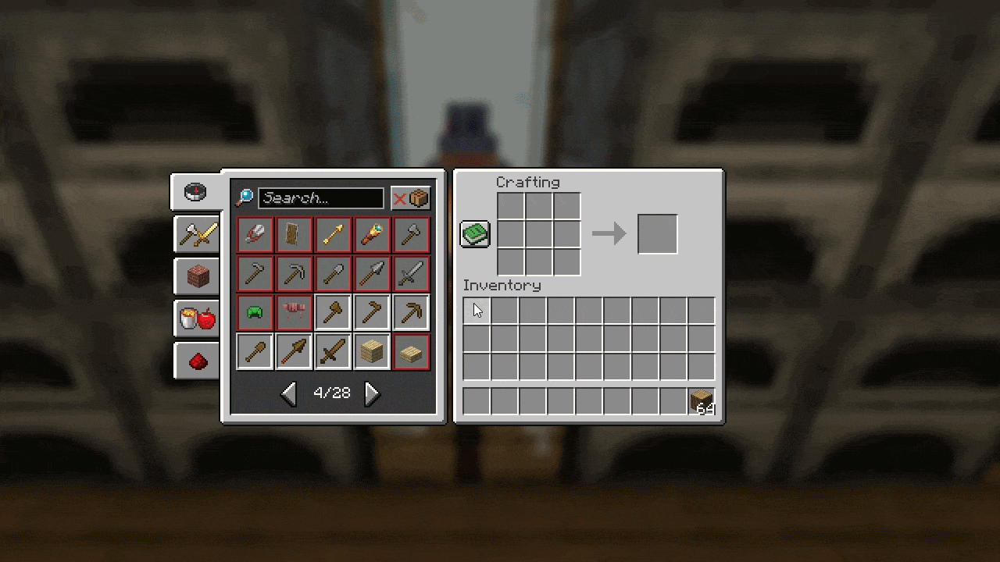
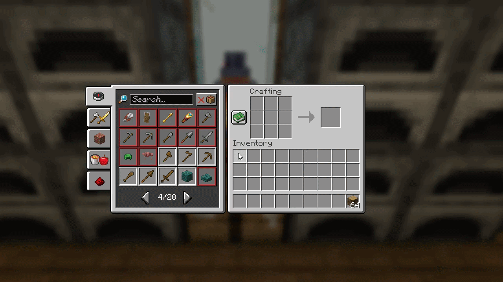

# LazyCraft

LazyCraft is a collection of crafting quality-of-life features designed to make Minecraft’s recipe book faster and more
intuitive to use.

## Recursive Crafting

Crafting an item you don't have the ingredients for?

LazyCraft crafts those ingredients for you! (Provided you have the ingredients for those too)

## Direct Recipe Book Crafting

Double-click a recipe in the recipe book to have it automatically crafted and placed in your inventory.

## Inventory Space

Some free inventory space is recommended.

LazyCraft temporarily places intermediate items into your inventory so they can be used by the following crafting steps.
If your inventory is completely full, Minecraft may briefly display or drop ghost items during the process. These do not
replace or consume any additional ingredients, but crafting is more reliable when a few slots are available.

## Features

- Recursive crafting through the recipe book
- Direct crafting from recipe-book entries
- Crafting-table and player-inventory crafting
- Support for modded crafting recipes
- Multiplayer server support

Because LazyCraft performs several normal crafting actions in quick succession, some servers with strict anti-cheat
systems may interfere with recursive crafting.

## Planned Features

- Dynamic support for additional crafting stations
- Further crafting quality-of-life options

## Development Status

LazyCraft is currently in early development. Features, behavior, configuration options, and compatibility may change
between releases.

Bug reports and feedback are welcome.

## License

LazyCraft is licensed under the MIT License.
